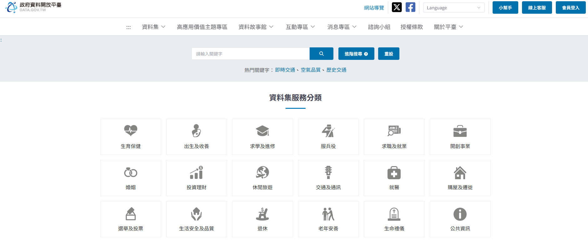

# 期末報告-個人介紹與網路爬蟲成果展示

## 專案介紹
這是一個展示我的個人介紹與爬蟲成果的網頁

## 網站連結
我的網頁[點我前往](https://hanke1107.github.io/hanke.github.io/index.html)

## 頁面簡介
  - *關於我
  - *個人簡歷
  - *爬蟲成果展示

## 使用技術
 - 1.HTML
 - 2.CSS
 - 3.GitHub Pages
 - 4.Python

## 爬蟲網站

## 作者
- 劉翰宇，靜宜大學 大學部資科系學生
- 聯絡方式:hankeliu1107@gmail.com
